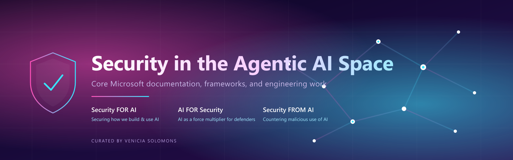

  

<h1 align="center">Security in the Agentic AI Space</h1>

  <em>A single-pane reference for the official Microsoft documentation, frameworks, and engineering work that defines how we secure, govern, and defend with autonomous AI agents.</em>

  <a href="#-foundation">Foundation</a> ·
  <a href="#-pillar-1-security-for-ai">Security FOR AI</a> ·
  <a href="#-pillar-2-ai-for-security">AI FOR Security</a> ·
  <a href="#-pillar-3-security-from-ai">Security FROM AI</a> ·
  <a href="#-project-mdash">MDASH</a> ·
  <a href="#-project-glasswing">Glasswing</a> ·
  <a href="#-connect">Connect</a>

---

## Why this exists

Agentic AI changes the security model. Agents don't just answer prompts; they take actions, hold identities, call tools, persist memory, and chain together to complete multi-step goals. That shift breaks assumptions baked into a decade of identity, data, network, and SecOps tooling.

If you're trying to figure out where to start, what's official, and what's new, the Microsoft documentation set is now genuinely huge. This page collects the pieces that actually matter, organised the way Microsoft thinks about the problem.

## The three-pillar model

Everything here hangs off the [Zero Trust adoption framework](https://learn.microsoft.com/en-us/security/zero-trust/adopt/zero-trust-adoption-overview) and splits cleanly into three pillars:

| Pillar | What it covers |
| :--- | :--- |
| **Security FOR AI** | Securing how your organisation builds, deploys, and uses AI: models, agents, data, identities, prompts. |
| **AI FOR Security** | Using AI as a force multiplier for defenders. Security Copilot, agentic SOC, AI inside Defender and Entra. |
| **Security FROM AI** | Countering malicious use of AI. Adversarial agents, prompt injection at scale, AI-accelerated threat actors. |

> All links in this document have been validated against `learn.microsoft.com` and `microsoft.com`. If you find one broken, open an issue.

---

## 🧭 Foundation

The starting points. If you only read four things, read these.

### Zero Trust and the Security-for-AI library
- [Zero Trust adoption framework, overview](https://learn.microsoft.com/en-us/security/zero-trust/adopt/zero-trust-adoption-overview)
- [Zero Trust overview](https://learn.microsoft.com/en-us/security/zero-trust/zero-trust-overview)
- [Microsoft Security for AI, library home](https://learn.microsoft.com/en-us/security/security-for-ai)
- [Security for AI, posture](https://learn.microsoft.com/en-us/security/security-for-ai/posture)
- [Zero Trust partner kit](https://learn.microsoft.com/en-us/security/zero-trust/zero-trust-partner-kit)

### Cloud Adoption Framework, AI scenario
- [CAF, AI scenario landing](https://learn.microsoft.com/en-us/azure/cloud-adoption-framework/scenarios/ai/)
- [CAF, Secure AI](https://learn.microsoft.com/en-us/azure/cloud-adoption-framework/scenarios/ai/secure)
- [CAF, Govern AI](https://learn.microsoft.com/en-us/azure/cloud-adoption-framework/scenarios/ai/govern)
- [CAF, AI platform: security](https://learn.microsoft.com/en-us/azure/cloud-adoption-framework/scenarios/ai/platform/security)
- [CAF, AI platform: governance](https://learn.microsoft.com/en-us/azure/cloud-adoption-framework/scenarios/ai/platform/governance)
- [CAF, AI infrastructure: governance](https://learn.microsoft.com/en-us/azure/cloud-adoption-framework/scenarios/ai/infrastructure/governance)
- [CAF, AI agents: governance and security across the organisation](https://learn.microsoft.com/en-us/azure/cloud-adoption-framework/ai-agents/governance-security-across-organization) **← the agent-specific governance baseline**

### Threat modeling AI/ML
- [Threat modeling AI/ML systems and dependencies](https://learn.microsoft.com/en-us/security/engineering/threat-modeling-aiml)
- [Securing the future of AI and ML at Microsoft](https://learn.microsoft.com/en-us/security/engineering/securing-artificial-intelligence-machine-learning)
- [SFI, threat modeling AI](https://learn.microsoft.com/en-us/security/zero-trust/sfi/threat-modeling-ai)

---

## 🛡️ Pillar 1: Security FOR AI

### Agentic identity and access: Microsoft Entra Agent ID

> Agents are first-class principals. Entra Agent ID gives every agent a verifiable identity, lifecycle, conditional access, and governance. The same controls you'd expect for a human or a workload identity.

- [What is Microsoft Entra Agent ID](https://learn.microsoft.com/en-us/entra/agent-id/what-is-microsoft-entra-agent-id)
- [Agent identities](https://learn.microsoft.com/en-us/entra/agent-id/agent-identities)
- [What are agent identities](https://learn.microsoft.com/en-us/entra/agent-id/what-are-agent-identities)
- [Security for AI, identity professional view](https://learn.microsoft.com/en-us/entra/agent-id/identity-professional/security-for-ai)
- [Agent ID, governance overview](https://learn.microsoft.com/en-us/entra/id-governance/agent-id-governance-overview)

### Microsoft Agent 365: enterprise control plane for agents

> Agent 365 is Microsoft's enterprise platform for managing every agent (Microsoft-built or third-party) inside your tenant. Registry, identity, security, observability, compliance.

- [Why Agent 365 for the enterprise](https://learn.microsoft.com/en-us/microsoft-agent-365/leadership/why-agent-365-for-enterprise)
- [Defender and Agent 365](https://learn.microsoft.com/en-us/microsoft-agent-365/leadership/defender-agent-365)
- [Entra and Agent 365](https://learn.microsoft.com/en-us/microsoft-agent-365/leadership/entra-agent-365)
- [Govern agents without slowing innovation](https://learn.microsoft.com/en-us/microsoft-agent-365/leadership/govern-agents-support-innovation)
- [Agent 365 security (in the Security-for-AI library)](https://learn.microsoft.com/en-us/security/security-for-ai/agent-365-security)
- [Agent 365 SDK, developer](https://learn.microsoft.com/en-us/microsoft-agent-365/developer/agent-365-sdk)
- [Connect existing agents](https://learn.microsoft.com/en-us/microsoft-agent-365/connect-existing-agents)
- [Responsible AI FAQ](https://learn.microsoft.com/en-us/microsoft-agent-365/admin/responsible-ai-faq)
- [Entra capabilities for Agent 365](https://learn.microsoft.com/en-us/microsoft-agent-365/admin/capabilities-entra)
- [Microsoft 365 Copilot agent store](https://learn.microsoft.com/en-us/microsoft-365/copilot/copilot-agent-store)
- [M365 Copilot agent essentials, overview](https://learn.microsoft.com/en-us/microsoft-365/copilot/agent-essentials/agent-essentials-overview)

### Defender for AI: workload and runtime protection

> The Defender stack now covers AI workloads end-to-end. Posture (AI-SPM) before deployment, runtime threat protection across Azure OpenAI / Foundry / agentic apps, and content-layer defences via Prompt Shields.

- [Defender for AI in Microsoft Defender XDR](https://learn.microsoft.com/en-us/defender-xdr/security-for-ai/defender-security-for-ai)
- [Defender for Cloud, AI threat protection](https://learn.microsoft.com/en-us/azure/defender-for-cloud/ai-threat-protection)
- [Defender for Cloud, AI Security Posture Management (AI-SPM)](https://learn.microsoft.com/en-us/azure/defender-for-cloud/ai-security-posture)
- [Azure AI Content Safety, jailbreak (Prompt Shields) detection](https://learn.microsoft.com/en-us/azure/ai-services/content-safety/concepts/jailbreak-detection)

### Data governance for AI: Microsoft Purview
- [AI hub in Microsoft Purview](https://learn.microsoft.com/en-us/purview/ai-microsoft-purview)
- [Data Security Posture Management (DSPM) for AI](https://learn.microsoft.com/en-us/purview/dspm-for-ai)

### Zero Trust overlay for Copilots and M365
- [Apply Zero Trust to Microsoft Copilots, overview](https://learn.microsoft.com/en-us/security/zero-trust/copilots/apply-zero-trust-copilots-overview)
- [Microsoft 365 Zero Trust](https://learn.microsoft.com/en-us/security/zero-trust/microsoft-365-zero-trust)

---

## 🤖 Pillar 2: AI FOR Security

> Defenders are outnumbered. Agentic AI inside the SOC closes that gap. Security Copilot is the entry point; it's now embedded across the Microsoft Security portfolio and is becoming agentic itself.

### Microsoft Security Copilot
- [Microsoft Security Copilot, overview](https://learn.microsoft.com/en-us/copilot/security/microsoft-security-copilot)
- [Security Copilot FAQ](https://learn.microsoft.com/en-us/copilot/security/faq-security-copilot)
- [Application card, overview](https://learn.microsoft.com/en-us/copilot/security/security-copilot-application-card)
- [Application card, agents](https://learn.microsoft.com/en-us/copilot/security/security-copilot-application-card-agents)
- [Responsible AI FAQ, Security Copilot](https://learn.microsoft.com/en-us/copilot/security/rai-faqs-security-copilot)

### Unified SecOps and Copilot in Defender / Entra
- [Unified security operations, overview](https://learn.microsoft.com/en-us/unified-secops/overview-unified-security)
- [Security Copilot in Microsoft Entra](https://learn.microsoft.com/en-us/entra/security-copilot/security-copilot-in-entra)

---

## 🎯 Pillar 3: Security FROM AI

> Adversaries are using AI too. Phishing at scale, malware variant generation, deepfakes, agentic recon. This pillar covers Microsoft's intelligence work, detection content, and the defensive AI Microsoft itself runs against attackers.

- [Defender XDR, security for AI (covers AI-targeted attacks)](https://learn.microsoft.com/en-us/defender-xdr/security-for-ai/defender-security-for-ai)
- [Microsoft Security Insider hub (MDDR, MTAC, threat reports)](https://www.microsoft.com/en-us/security/security-insider)
- [Microsoft Digital Defense Report](https://www.microsoft.com/en-us/security/business/microsoft-digital-defense-report) — annual report with sections on AI-enabled threats and influence operations

---

## 🧪 Project MDASH

**MDASH** (Multi-model Agentic Scanning Harness) is Microsoft's autonomous vulnerability-discovery agent, built by the Autonomous Code Security team led by VP Taesoo Kim.

| | |
| :--- | :--- |
| **What it is** | 100+ specialised AI agents orchestrated to find, triage, and validate security bugs at scale |
| **Benchmark** | 88.45% on the CyberGym benchmark, top of the public leaderboard |
| **Real-world impact** | 16 CVEs shipped in the 12 May 2026 Patch Tuesday release |
| **Recall** | 96% on `clfs.sys`, 100% on `tcpip.sys` against the MSRC historical backlog |
| **Status** | Private preview |

Read more:
- [Defense at AI speed, Microsoft Security blog (12 May 2026)](https://www.microsoft.com/en-us/security/blog/2026/05/12/defense-at-ai-speed-microsofts-new-multi-model-agentic-security-system-tops-leading-industry-benchmark/)
- [Private preview sign-up: aka.ms/AI-drivenScanningHarness](https://aka.ms/AI-drivenScanningHarness)

---

## 🔬 Project Glasswing

**Glasswing** is an Anthropic-led cross-industry initiative on the safe use of agentic AI for offensive-security research, testing Claude Mythos Preview for autonomous vulnerability discovery.

Microsoft is a participant alongside AWS, Apple, Broadcom, Cisco, CrowdStrike, Google, JPMorganChase, Linux Foundation, NVIDIA, and Palo Alto Networks.

- [Anthropic, Project Glasswing](https://www.anthropic.com/glasswing)
- [MSRC blog, Strengthening secure software at global scale: how MSRC is evolving with AI (Apr 2026)](https://www.microsoft.com/en-us/msrc/blog/2026/04/strengthening-secure-software-global-scale-how-msrc-is-evolving-with-ai)
- [Microsoft Security blog, AI-powered defense for an AI-accelerated threat landscape (22 Apr 2026)](https://www.microsoft.com/en-us/security/blog/2026/04/22/ai-powered-defense-for-an-ai-accelerated-threat-landscape/)

---

## 🚀 How to use this list

1. **Start with the Foundation.** Zero Trust adoption plus the Security-for-AI library home. Everything else hangs off these.
2. **Pick the pillar that matches your role.** Builders and platform teams live in Pillar 1. SOC and IR live in Pillar 2. Threat intel and red teams live in Pillar 3.
3. **If you operate agents at scale**, the critical reading is: Entra Agent ID → Agent 365 → Defender for AI → CAF AI-agents governance.
4. **If you're tracking the frontier**, follow MDASH and Glasswing. They show where defensive agentic AI is going next.

---

## 👋 Connect

If this was useful, or you want to talk AI security, Defender, Sentinel, Entra, or anything in between, I'd love to hear from you.

  
  

Spot a broken link or want a section added? [Open an issue](https://github.com/YourCybersecurityBestie/Learn-AI-Security/issues/new) or send a PR.
